# Learning a family of functions

**Goal**

The goal is to fit a curve to data, also known as **curve fitting,** We have to make a model learn a network that does not learn a single function but a family of functions. We will consider a family of sinusoidal functions. Below is the Family of functions used in the training and testing of the model.

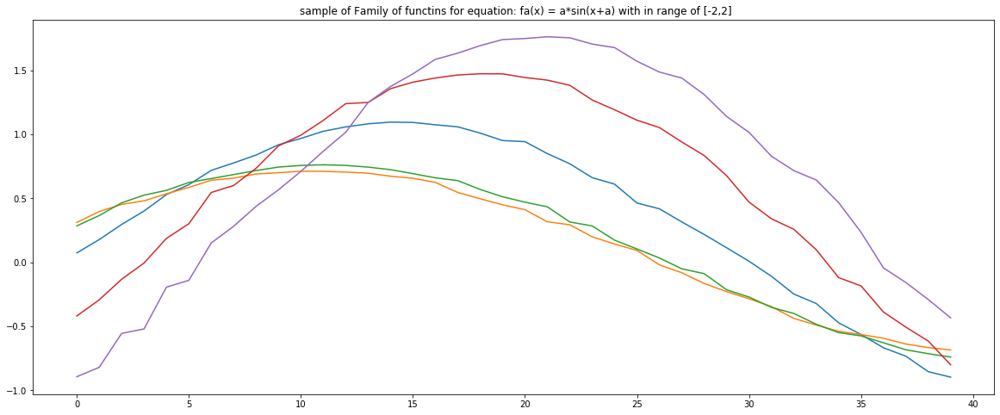

**Creating training data and data-loader**

- First, we select a random value of c in between (5,25) and then randomly select c values from 40 points of functions  {𝑓𝑎}  and save as (Xc, Yc) 
- Second, we save Xt values along with Yt values of functions  {𝑓𝑎} as random.
- The values of (Xc, Yc) with Xt are saved as *DataX* and Yt values as *DataY*
- Then we use *train\_test\_split* from sklearn to split the data in *X\_train, X\_test, y\_train, y\_test* with the test set being chosen from fully random 30% of all data.
- Where we will use *X\_train* and *y\_train* to train the model and *X\_test* and *y\_test* to test the learning rate 

*Xt and Yt values                                                     Xc and Yc values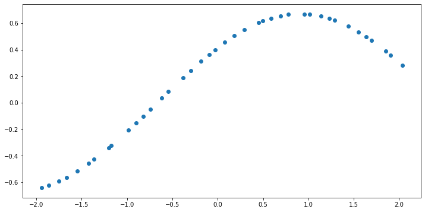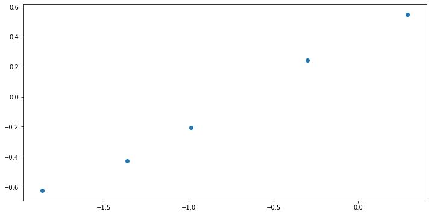*

**Encoder & Decoder** 

- Encoder class takes in all (Xc, Yc) values and then average finally takes out the average value or Rc 
- Decoder class takes in the Rc along with Xt value and tries to predict the Yt value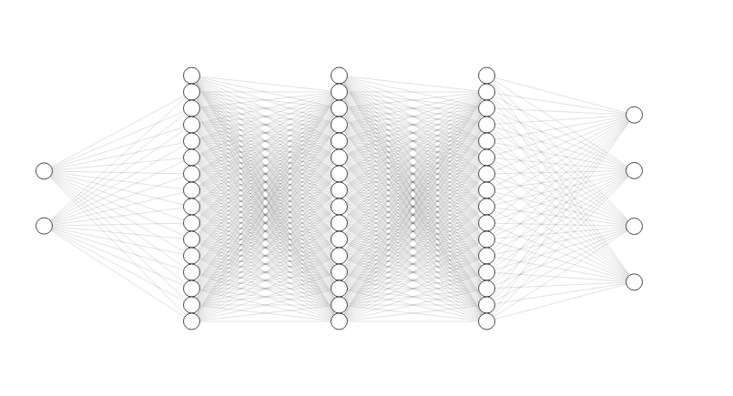

Encoder input : (Xc,Yc)                                                   Decoder input: (avg(Rc), Xt )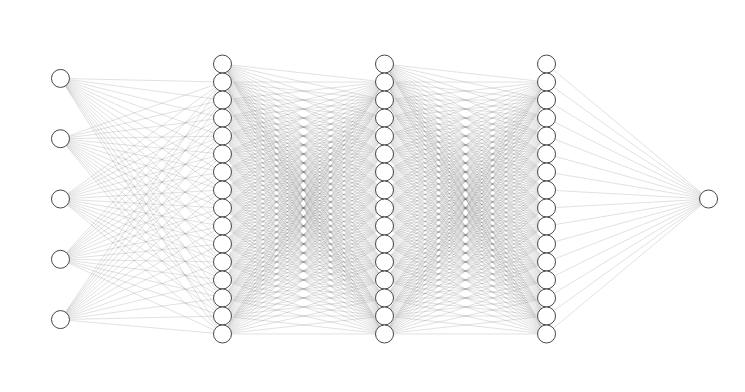

Encoder output: average of (Rc)                                   Decoder output: expected (Yt)

**Optimizer and Loss Value** 

- According to the difference between the real value of Yt and the predicted value of Yt by the model we compute loss using the MSE loss function 
- This loss is then used to optimize the MLPs jointly using Adam optimizer.

**Training the model**

- We just fetch the values from X\_train one by one and then we split the X\_train values into 2 tensors one containing (Xc, Yc) and the other containing a list of Xts 
- We need to give all (Xc, Yc) values at once to the Model while we give only one Xt value, and based on its prediction we compute the loss for training the model. 
- Iterate over all Xt values and we train our model. Below is the overall training loss.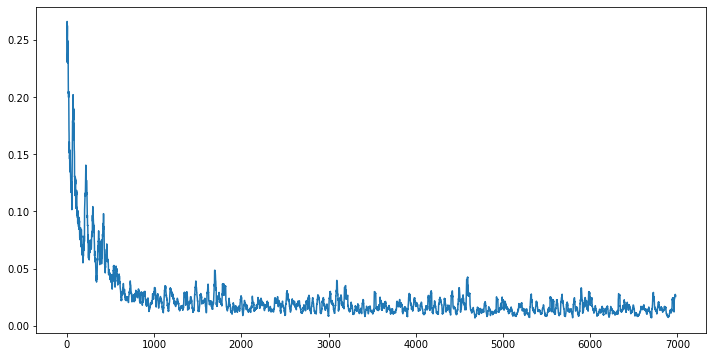
- The best results came from choosing hidden layer = 512 and R\_dim =64  

**Evaluation of the model**

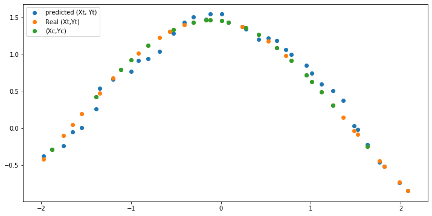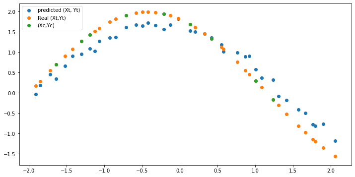

**Final plots from given data (With Hidden layer=512, and R\_dim=64)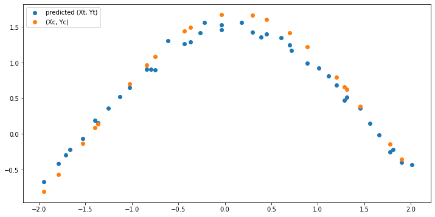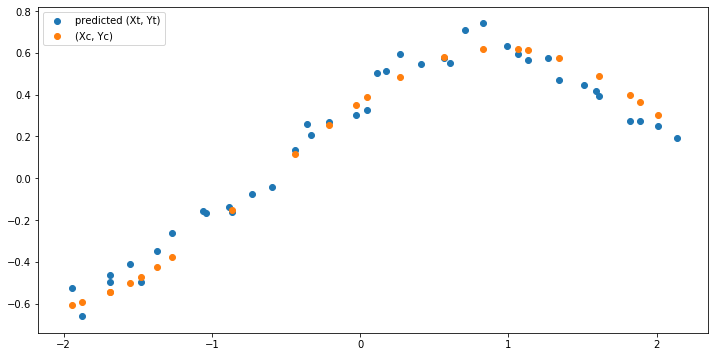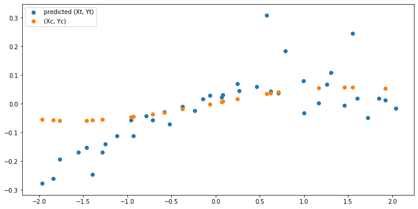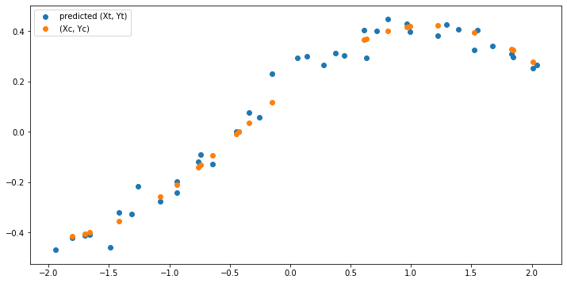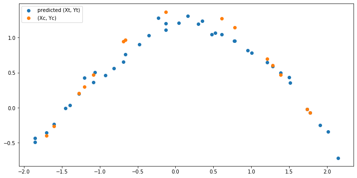**
